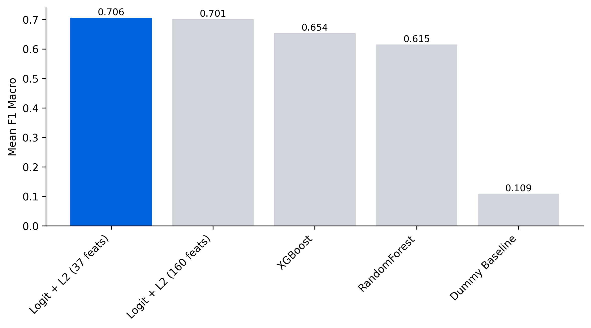
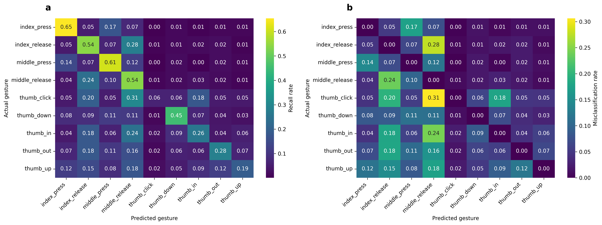
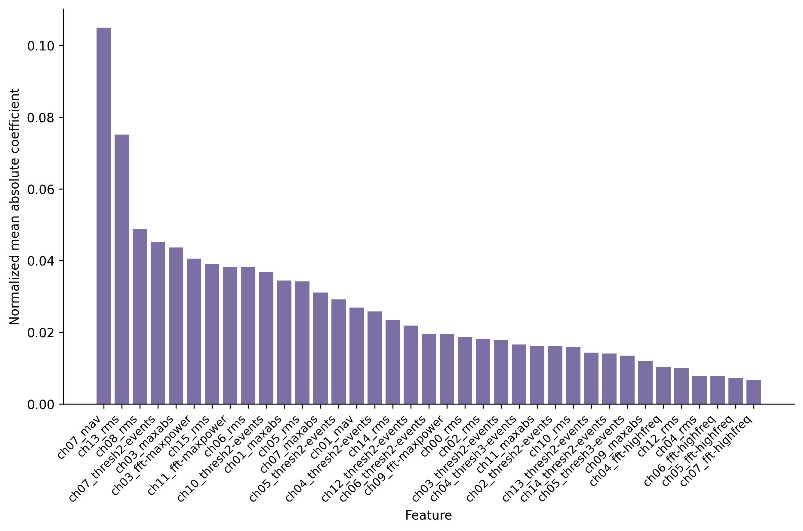

# fall-2025-gesture-recognition

**Authors:** Brian R. Mullen, Carrie Clark, Revati Jadhav, Philip Nelson, Sero Toriano Parel

**Erdős Institute Data Science Boot Camp Fall 2025 Project**

Implementing and evaluating personalized models for discrete hand gesture classification from surface electromyography (sEMG) signals. Our core methodology addresses the necessity of achieving robust within-user generalization (evaluation on the same user's unseen data) due to the high inter-user signal variability inherent in sEMG signatures. The project utilizes the `discrete_gestures` in the `generic-neuromotor-interface` dataset ([Kaifosh et al. 2025](https://doi.org/10.1038/s41586-025-09255-w)) to support robust wearable device design.

## Key Performance Indicators (KPIs)

* **Primary KPI:** F1 Macro score, to maximize classification performance across all nine discrete gesture classes, robustly addressing challenges posed by multi-class classification and potential class imbalance stemming from gesture/stage combinations with low counts.
* **Secondary KPIs:** Classification accuracy, classification error rate
* **Evaluation Strategy:** Performance was measured using within-user cross-validation (CV) and confirmed on a final, untouched test holdout set

## Quick Start

**1. Setup & data (from the [`generic-neuromotor-interface`](https://github.com/facebookresearch/generic-neuromotor-interface?tab=readme-ov-file#setup) repo):**
```bash
git clone https://github.com/facebookresearch/generic-neuromotor-interface.git
cd generic-neuromotor-interface
conda env create -f environment.yml
conda activate neuromotor
pip install -e .
python -m generic_neuromotor_interface.scripts.download_data --task discrete_gestures --output-dir ~/emg_data
```
**Note:** The EMG data contains 101 files (100 users' recordings + metadata) totaling approximately *33.36 GB*.

**2. Extract features:**
```bash
cd fall-2025-gesture-recognition
python src/feature_extraction.py -i ~/emg_data
```

**3. One-click reproduction:** For a one-click reproduction of the entire analysis, run: `./run_pipeline.sh`
**Tip:** Use `./run_pipeline.sh --force` to bypass caching and force a full re-run of the feature extraction. Use `./run_pipeline.sh -v` for verbose logs or `./run_pipeline.sh -q` for quiet mode.

**4. Manual pipeline (optional):** Execute notebooks in order: `notebooks/eda.ipynb` → `notebooks/feature_selection.ipynb` → `notebooks/modeling_experiments.ipynb` → `notebooks/final_results.ipynb`

## Pipeline at a Glance

| Step | File | Primary Output Artifact |
| :--- | :--- | :--- |
| Extraction | `src/feature_extraction.py` | `data/interim/features_emg_data.csv` |
| EDA | `notebooks/eda.ipynb` | `data/processed/features_emg_data_cleaned.csv` |
| Selection (compute) | `src/run_feature_selection.py` | `results/tables/feature_selection.csv` and `data/processed/train_calib_selected.csv` |
| Selection (report) | `notebooks/feature_selection.ipynb` | `results/figures/` and `results/tables/` |
| Modeling (compute) | `src/run_modeling.py` | `results/tables/model_comparison.csv` |
| Modeling (report) | `notebooks/modeling_experiments.ipynb` | `results/figures/` and `results/tables/` |
| Final Results | `notebooks/final_results.ipynb` | `reports/final_results.html` |

## Engineering Challenges & Solutions

- **Missing Class Handling:** Some users had rare gestures that could disappear from a fold (e.g., User 51), causing non-contiguous class IDs and model crashes. The fix was a per-fold label re-encoding step inside cross-validation so each train/test split uses contiguous labels before fitting.
- **End-to-End Pipeline Automation:** The pipeline now runs from ~33GB of raw EMG data through feature extraction, modeling, and a finished HTML report with a single command (`./run_pipeline.sh`), making the full analysis reproducible end-to-end.
- **Compute Efficiency & Caching:** Implemented a 'skip-if-exists' caching layer in the automation script. The pipeline now detects if heavy artifacts (like the 33GB feature extraction output) already exist and skips the redundant computation, saving ~15 minutes per run during analysis iterations.
- **Compute vs. Reporting Architecture:** The pipeline separates heavy computation from visualization. Python scripts in `src/` handle parallel processing and artifact generation (using `tqdm` for progress tracking), while Jupyter Notebooks in `notebooks/` simply load the results to generate strict, reproducible reports.

To run end-to-end with documented ordering, see `run_pipeline.sh`.

## Project Deliverables and Final Results

| Deliverable | Description |
| :--- | :--- |
| Problem Definition & KPIs | Project guiding question, stakeholders, and KPI definitions finalized (`kpis.md`) |
| Data Acquisition & Preparation | Raw sEMG data for 100 participants successfully loaded. Data cleaned, aligned (event-based peak detection), and preprocessed using Z-score normalization applied separately to each of the 16 EMG channels |
| Evaluation Plan | Personalized split implemented using stratified 80/20 K-Fold per user (within-user CV) to ensure evaluation mirrors deployment scenarios |
| Feature Engineering | Feature extraction yielded 160 features. Feature selection (by random forest ranking and correlation pruning) successfully reduced the feature space to 37 non-redundant metrics. Key features included RMS metrics, concentrated heavily on sEMG channels ch05, ch04, and ch10. |
| Modeling & Validation | Evaluated trivial, linear (Logistic Regression), and tree-based models (random forest, XGBoost). Final model selected: **Logistic Regression with L2 regularization (Logit\_L2)** due to robust CV performance and interpretability. |
| Final Results | **Strong within-user generalization** achieved on calibration data splits (CV Mean F1 Macro = $\mathbf{0.7060}$). Compared to the original RandomForest baseline (Mean F1 Macro = 0.609939, Mean Accuracy = 0.640239), **Logit\_L2** improved performance (Mean F1 Macro = $\mathbf{0.7060}$, Mean Accuracy = $\mathbf{0.7257}$). **Poor generalization to unseen gestures** (Holdout Test F1 Macro = $\mathbf{0.390907}$, Holdout Test Accuracy = $\mathbf{0.456762}$), confirming significant performance heterogeneity across users. Analysis: `thumb_out` showed the highest recall improvement (16%) when additional training samples were available. |
| Final Documentation | Executive summary (`summary.pdf`) and presentation slide deck (`deliverables/presentation.pdf`) finalized and stored. |

## Key Visualizations


Model Performance: Our optimized logistic regression (Meta Blue) outperforms both the full-feature version and complex ensembles, proving that physiological feature selection (160 → 37 features) drives better generalization than brute force.


Confusion matrix showing classification performance. Off-diagonal elements highlight specific gestures that are frequently misclassified.


Dimensionality Reduction: The feature selection pipeline identified 37 critical metrics, heavily weighting the RMS of Channels 4 and 5. This validates the physiological relevance of the model.

## Repository Structure Overview

```
├── data/
│   ├── interim/    # Intermediate processing (e.g., raw features)
│   └── processed/  # Cleaned data for modeling
├── results/
│   ├── figures/    # Generated plots (PNG/SVG)
│   ├── tables/     # Analysis metrics (CSVs)
│   └── final/      # Final reports
├── src/
│   ├── run_feature_selection.py  # Heavy compute script
│   └── run_modeling.py           # Heavy compute script
└── notebooks/      # Lightweight reporting only
```

## References

- Kaifosh, P., Reardon, T.R. & CTRL-labs at Reality Labs. A generic non-invasive neuromotor interface for human-computer interaction. Nature (2025). https://doi.org/10.1038/s41586-025-09255-w
- Kaifosh, P., Reardon, T.R. & CTRL-labs at Reality Labs. A generic non-invasive neuromotor interface for human-computer interaction. (2025). GitHub repository, https://github.com/facebookresearch/generic-neuromotor-interface
